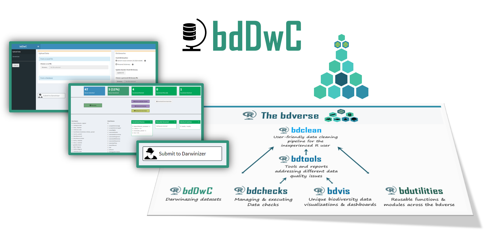

# bdDwC
 

   

## Overview
`bdDwC` is a R package that supplies an interactive Shiny app and a set of functions for standardizing field names in compliance to the Darwin Core (DwC) format. Running bdDwC enables you to carefully standardize all field names in your dataset – which allows the `bdverse` to handle data from various biodiversity portals seamlessly, and lets you enjoy all of its features, regardless of publishers variation in field names.
The development of bdDwC was inspired by the <a href="http://kurator.acis.ufl.edu/kurator-web/" target="_blank">Kurator project</a> <a href="https://github.com/kurator-org/kurator-validation/wiki/CSV-File-Darwinizer" target="_blank">'Darwinizer tool'</a>. `bdDwC` utilizes Darwin Cloud dictionary <a href="https://doi.org/10.3897/tdwgproceedings.1.20486" target="_blank">(Wieczorek et al. 2017)</a>, which is basically a lookup table that accumulates different variations in DwC field names, maintained by the Kurator team. It's also possible to add your own dictionary by creating a CSV file with two columns, one for the Field Names and one for the Standard Names.

## Architecture

TBA

## Main challenges

* Establishing and maintaining a robust workflow for feeding the Darwin Cloud - to address this issue, we'll consult key members of the biodiversity informatics community.
* "Darwinizing" a dataset is a core component in any `bdverse` tools and workflows, thus developing an intensive QA shell is in order.

## Future Plans

* Enhancing the UI
* Exploring the possibility to create and maintain a specific dictionary for every publisher.
* Experimenting with fuzzy matching techniques to generate suggestions.
* Exploring new frontiers for enforcing recommended DwC vocabulary.

