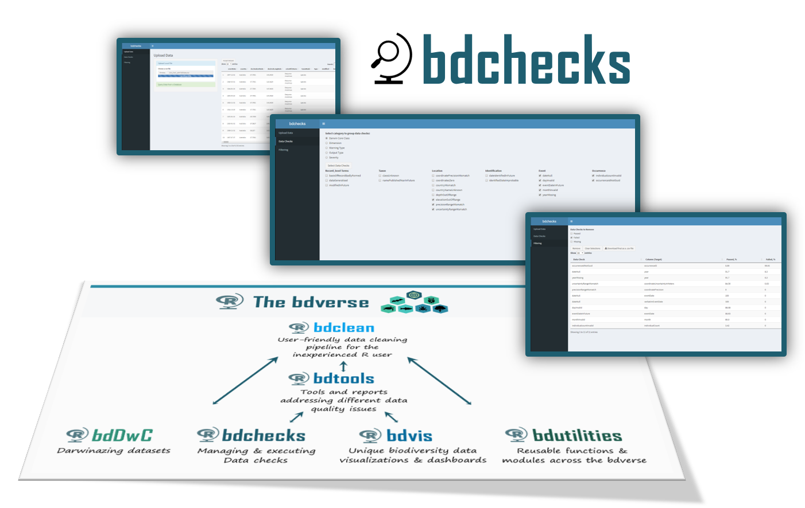

# bdchecks

   

## Overview

`bdchecks` is an infrastructure for performing, filtering and managing various biodiversity data checks using R. Handling data checks is a fundamental aspect of promoting biodiversity data quality.

`bdchecks` offers various features for different types of R users:
* An interactive and user-friendly Shiny app for the inexperienced R users.
* Full command line functionality for more experienced R users.
* Advanced R users can easily edit, add and manage thier own collection of data checks, using one single YAML file and only two supporting R functions.

## Architecture

[TBA]

## Main challenges

* Our main mission is to successfully implement all core suite of tests and assertions being developed by TDWG’s Biodiversity Data Quality 'Task Group 2: Data Quality Tests and Assertions'. This is easier said than done. Though `bdchecks` core is designed to match the tests' structure, developing and maintaining complete synchronization will be challenging.
* Complete reproducibility is not yet implemented. We still need to figure out an ideal way to generate it. 

## Future Plans

* To construct and test as many data checks as possible.
* Enhancing the UI and the overall documentation.
* Implementing a report that lists unsuccessful data checks and describes the errors. 
* Developing a Shiny app for easily editing the YAML file.
* Exploring different types of data checks, such as value-dependent checks.

