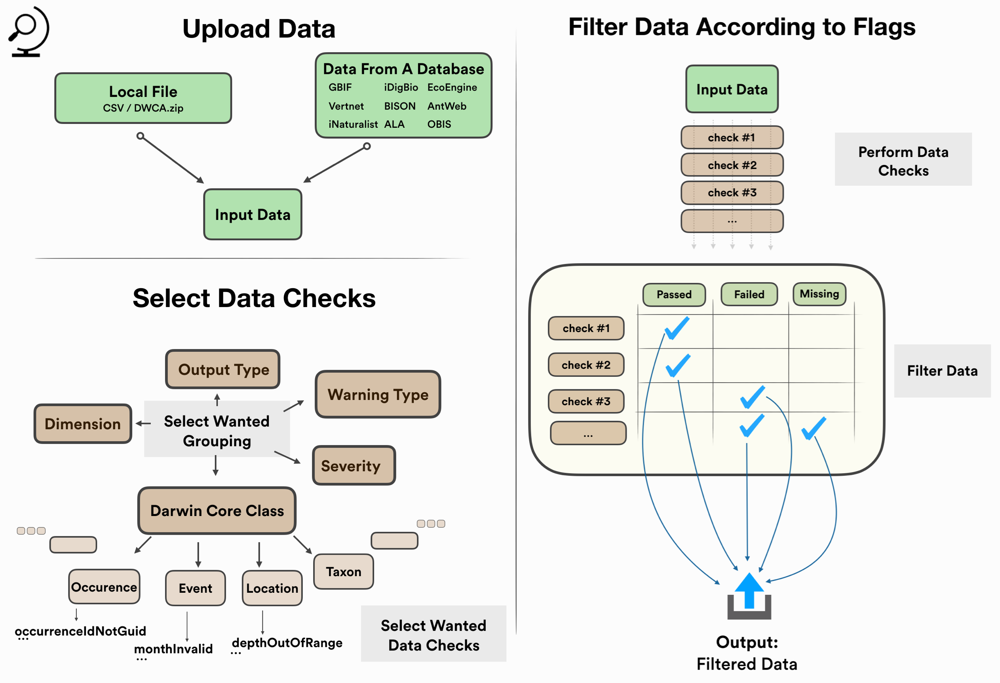

## bdchecks: an infrastructure for biodiversity data checks

   

`bdchecks` is an infrastructure for performing, filtering and managing various biodiversity data checks using R. Data checks are a key to promoting biodiversity data quality.

`bdchecks` offers various features for different types of R users:
* An interactive and user-friendly Shiny app for inexperienced R users.
* Full command line functionality for more experienced R users.
* Advanced R users can easily edit, add and manage their own collection of data checks, using one single YAML file and only two supporting R functions.

## Architecture overview

## Major challenges ahead

* Our main mission is to successfully implement all core suite of tests and assertions being developed by TDWG’s Biodiversity Data Quality 'Task Group 2: Data Quality Tests and Assertions'. Though `bdchecks` core is designed to match the test structure, developing and maintaining complete synchronization will be challenging.
* Complete reproducibility is not yet implemented. We still need to figure out an ideal way to generate it. 

## Future plans

* Construct and test as many data checks as possible.
* Enhance the UI and the overall documentation.
* Implement a report that lists unsuccessful data checks and describes the errors. 
* Develop a Shiny app for easy editing of the YAML file.
* Explore different types of data checks, such as value-dependent checks.
