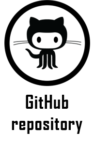
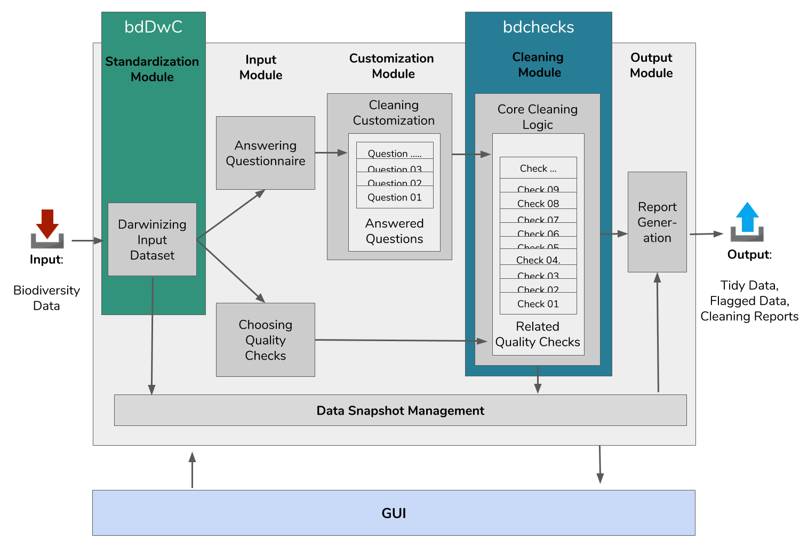

## bdclean: user level cleaning workflow for the inexperienced R user

   

`bdclean` is a user-friendly data cleaning [Shiny app](https://shiny.rstudio.com) for the inexperienced R user. It provides features to manage complete workflow for biodiversity data cleaning, including data upload; user input - in order to adjust cleaning procedures; data cleaning; and finally, generation of various reports and versions of the data (flagged, and cleaned).
In order for `bdclean` to truly be practical, several unique and challenging R components were developed, such as a questionnaire module and high-quality report mechanism. Also, since `bdclean` was developed for the inexperienced R user, `bdclean` GUI is highly intuitive.

## Architecture overview

## Major challenges ahead

* Continuous Integration (CI) is more challenging for `bdclean` as it highly depended on many R packages outside the `bdverse` and within the `bdverse`. 
* `bdclean` is a complex Shiny app, comprehensive testing techniques for apps are more challenging.

## Future plans

Right now, the questionnaire and the cleaning procedures are  designed for researchers dealing with species distribution modeling (SDM), as biodiversity data is being highly utilized for SDMs. with the help of the Biodiversity Informatics community, we plan to adjust `bdclean` to various other research domains, such as (i) alien and invasive species; (ii) collection data; (iii) agrobiodiversity; (iv) marine species; and (v) citizen science.
