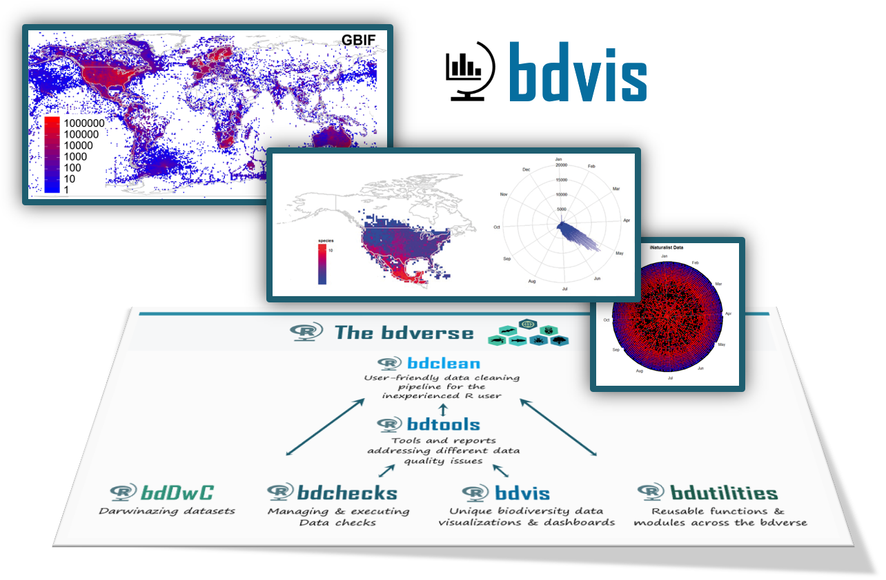

## bdvis: biodiversity data visualizations 

`bdvis` generates interesting visualizations  of your data with ease. It is a R package which helps to understand completeness of biodiversity inventory, extent of geographical, taxonomic and temporal coverage, gaps and biases in data. The package was inspired by the <a href="http://www.unav.es/unzyec/mzna/biddsat/" target="_blank">BIDDSAT</a> described in <a href="https://academic.oup.com/bioinformatics/article/28/16/2207/325294" target="_blank">Otegui and Ariño, 2012</a>. BIDDSAT is static and cannot be run with custom data, and the package `bdvis` was developed in order to fill this gap. Description of the package is available in <a href="https://academic.oup.com/bioinformatics/article/32/19/3049/2196391" target="_blank">Barve & Otegui, 2016</a>.

## Architecture overview
[TBA]

## Major challenges ahead

* Developing a versatile sent of visualizations to highlight spatial, temporal and taxonomic dimentions of biodiversity occurrence data 

## Future plans

* To enhance the UI using shiny and dashboards.
* To enhance the UI and the overall documentation.
