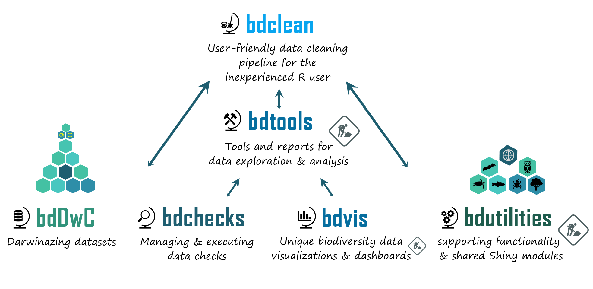

## What is the bdverse?

A collection of packages that form a general framework for facilitating biodiversity science in R.

## Our vision

To develop a **sustainable and agile** infrastructure that enhances the value of biodiversity data by allowing users to conveniently employ R, for data exploration, quality assessment, data cleaning, and standardization. 

## Objectives

* To advance user level data exploration and cleaning of biodiversity data in R.
* To support users with- and without programming capabilities.
* To promote implementation of biodiversity standards, methodology and tools being developed by the Biodiversity Informatics community.
* To enrich both the biodiversity research community and the R users community.

## Project timetable

*GSoC stands for <a href="https://summerofcode.withgoogle.com/" target="_blank">Google Summer of Code</a> 

## Development strategy

Building and maintaining the `bdverse` is like building a ‘house of cards’, due to the massive dependencies between dozens of R packages. We bare this in mind going into any development task. 

**Our plans for the next few months, before officially launching the `bdverse`**:

* Our focal point for the near future is **QA+CI+GUI**. Our efforts will be focused on developing a robust quality assurance (QA) framework; implementing continuous integration (CI) across the `bdverse`, and enhancing the GUI as much as possible.
* We will construct the`bdverse` package, that will install all `bdverse` features using a single code line: `install.packages("bdverse")`.
* We are working on submitting the released bdverse packages to [rOpenSci software review](https://ropensci.org/software-review/) as soon as the packages meet core requirements.
* We also hope to implement Shiny modules (trials will start soon).
* We will upgrade the `bdverse` website, to better showcase the different `bdverse` features to users, and to give it a more sleek look.

**Our plans for the second development phase are**:

* To identify key missing features, and address them using three GSoC projects.
* To establish one or two more GSoC project, that will be devoted to purely experimental challenges.

## Fundings

